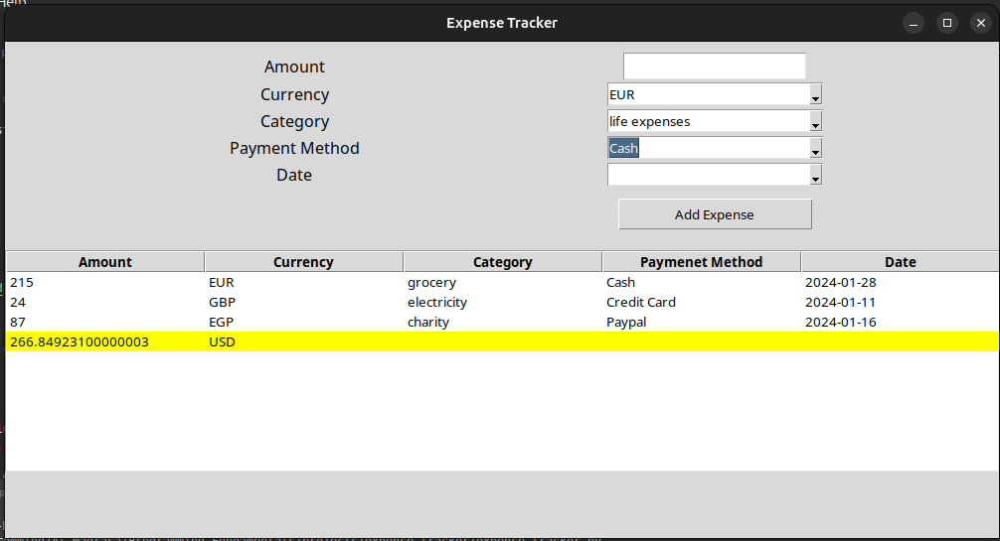

# Expense Tracker

python expense tracker app with GUI using tkinter library

This is the third project of first stage of Almdrasa

## Table of contents

- [Overview](#overview)
  - [The challenge](#the-challenge)
  - [Screenshot](#screenshot)
  - [Links](#links)
- [My process](#my-process)
  - [Built with](#built-with)
  - [What I learned](#what-i-learned)

## Overview

This is expense tracker app with it's GUI using tkinter library and currency API to cinverte total to USD.

### The challenge

- Make a user-friendly GUI using tkinter library
- User add new expense using amount, currency, category, payment method and date of the expense
- When click add expense btn it collect data that user added and add new expense field on the treeview window
- Automaticallly new field added to treeview to calculate the sum of all expenses added
- this sum of all expenses converted from any currency to USD

### Screenshot

.

### Links

- Solution URL: [Solution URL](https://github.com/Mohammed-Abol-Fotouh/expense-tracker)

## My process

- I used miro for planning for this project
- I used the right libraries and API's to make this app
- I used chatGPT for code refactoring and enhancement

### Built with

- Python
- Python tkinter library
- currency converter API
- chatGPT for enhanced version of the project

### What I learned

- In this project i learned how to use tkinter library more.
- Using API's to acheive goals
